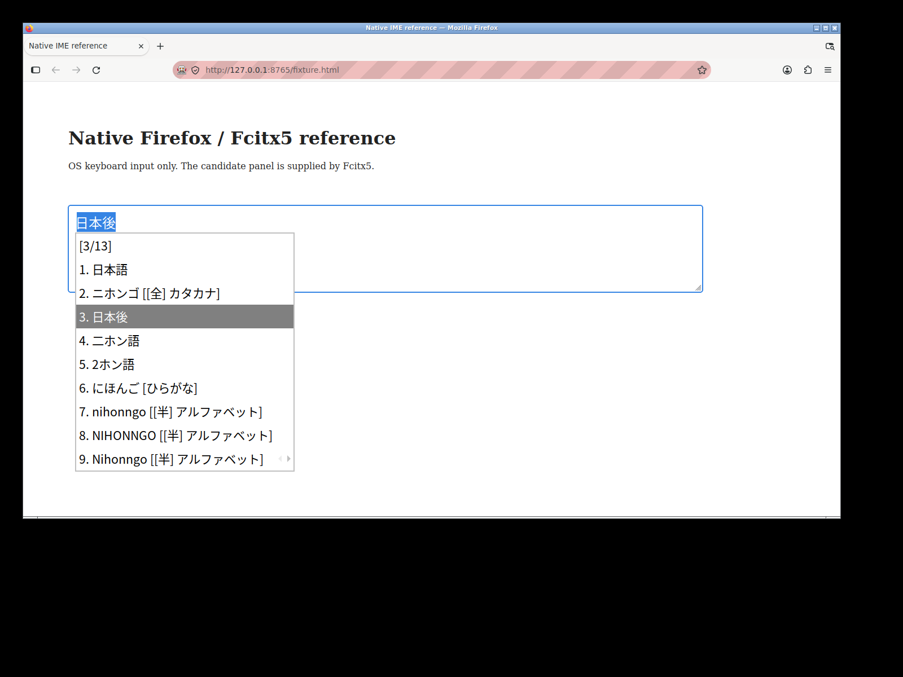
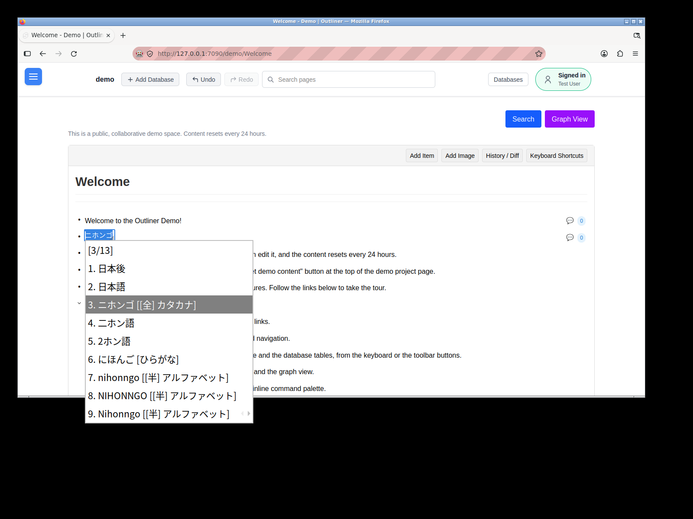

# Ubuntu Firefox/Fcitx5 native IME experiment

## Actual result and acceptance readiness

The dedicated workflow demonstrated **A–G on standard GitHub-hosted Ubuntu 24.04**. Regular
graphical Firefox used Fcitx5's GTK frontend for real Japanese composition and candidate selection.
The native panel was identified, measured and captured through X11, including while Outliner's
actual production textarea held focus. Negative controls rejected missing and incorrect panels.
The matched 5/40-character empty-item placement comparison also passed, but the original
regression was not reproduced. **H remains PARTIAL.**

This is an infrastructure PoC for [Issue #5501](https://github.com/kitamura-tetsuo/outliner/issues/5501).
No production editing source, existing CI matrix, issue requirements, or
[PR #5504](https://github.com/kitamura-tetsuo/outliner/pull/5504) was changed. Nothing was merged or
closed. **REQ-002 is not verified.** The native observation mechanism works, but an authoritative
acceptance oracle still requires coordinate calibration and controlled reproduction of the
original defect followed by the unchanged fix revision.

## Hosted execution evidence

The most recent inspected execution is
[run 37774299380](https://github.com/kitamura-tetsuo/outliner/actions/runs/37774299380).
Its source branch commit is `b58392095decbcb16ba5317de9b7ec6da6585cf3`; the actual tested checkout
is **`89796051b4fc7d01152cf42751755e4456d5c0f6`**, recorded in
`job_logs/native-ime/tested-sha.txt` and both stage `results.json` files.
GitHub PR runs test a generated merge commit, so the branch head is not interchangeable with the
tested SHA. The artifact is
[native-ime-37774299380-1](https://github.com/kitamura-tetsuo/outliner/actions/runs/37774299380/artifacts/11549746901).
The job completed successfully. The artifact contains native standalone/production observations,
negative controls and the passing limited reference comparison.
The [generated execution report](native-ime-evidence/execution-report.md) is retained alongside
the detailed analysis here.

The following screenshots from this run are also retained in the repository, beyond the short
Actions artifact lifetime. Raw JSON observations are retained only in the CI artifact:





The artifact's `job_logs/native-ime/standalone/candidate-open.json` and
`job_logs/native-ime/outliner/candidate-open.json` identify the panel and record trusted
composition/focus. These screenshots capture the actual desktop, not diagrammed or generated UI.

The earlier [run 37770271487](https://github.com/kitamura-tetsuo/outliner/actions/runs/37770271487)
independently proved A–F at tested merge checkout `7c38f52dddb2545ad51cf62ee41bf0893cb475fd`
(source `fe47908f8248f6fd986b8fe84f0d6272e3432d3d`). Its
[artifact](https://github.com/kitamura-tetsuo/outliner/actions/runs/37770271487/artifacts/11548075388)
also records successful application dependency provisioning, server build and service startup.

| Environment       | Measured value                                                                                                   |
| ----------------- | ---------------------------------------------------------------------------------------------------------------- |
| Runner            | GitHub-hosted `ubuntu-24.04`, Ubuntu 24.04.5 LTS; runner image `20261004.327.1`, runner 2.337.0                  |
| Browser           | Mozilla Firefox 157.0.1, regular desktop deb from Mozilla's signed apt repository                                |
| Fcitx5            | 5.1.7-1build3                                                                                                    |
| GTK3 frontend     | 5.1.1-1build2; `im-fcitx5` observed in Firefox process maps                                                      |
| Japanese engine   | Mozc 2.28.4715.102+dfsg-2.2build7                                                                                |
| X11 server        | Xvfb 2:21.1.12-1ubuntu1.8, Openbox, fresh D-Bus session                                                          |
| Desktop           | 1600 × 1200, depth 24, 96 DPI; Firefox devicePixelRatio 1                                                        |
| Input path        | `GTK_IM_MODULE=fcitx`, `GDK_BACKEND=x11`, `MOZ_ENABLE_WAYLAND=0`, `XDG_SESSION_TYPE=x11`, `XMODIFIERS=@im=fcitx` |
| Driver/read tools | Selenium 4.29.0, geckodriver 0.36.0; XTest/xdotool supplies all composition keystrokes                           |

Package lists, apt origin, active display diagnostics, Fcitx diagnosis, process maps and focused
input context are retained in the artifact. XIM and IBus frontends are disabled; the presence of
environment variables or started processes alone cannot pass the assertions.

## Independent capability results

| Capability                               | Classification | Actual oracle/evidence                                                                                                                                                                                                                                              |
| ---------------------------------------- | -------------- | ------------------------------------------------------------------------------------------------------------------------------------------------------------------------------------------------------------------------------------------------------------------- |
| A. Graphical native Firefox under X11    | PROVEN         | Desktop Firefox loaded a visible fixture, accepted an OS pointer click, and produced a real X11 window/root screenshot.                                                                                                                                             |
| B. Intended GTK/Fcitx5 input path        | PROVEN         | Loaded `im-fcitx` mapping, focused Firefox `frontend:dbus` context, CreateInputContext/ProcessKeyEvent traffic, and trusted inline preedit together.                                                                                                                |
| C. Japanese composition and selection    | PROVEN         | OS `nihonn` → `にほん`, extension `go` → `にほんご`; Space conversion, Down changes selection, Enter commits exactly the selected text; second composition cancels without changing the committed value.                                                            |
| D. Identify native candidate panel       | PROVEN         | Exactly one viewable `Fcitx5 Input Window`, class `fcitx/fcitx`, verified daemon PID and legitimate Classic UI window type, correlated with foreground trusted composition and screenshot pixels.                                                                   |
| E. Measure geometry and visibility       | PROVEN         | Root coordinates/dimensions/map state and matching screenshot crop; identity persists across selection, disappearance after Enter/Escape; candidate follows a moved reference input by (100,60). Desktop-window translation has a separate failed diagnostic below. |
| F. Reject missing/incorrect observations | PROVEN         | Real direct Latin input has no composition/panel; absent panel fails even with forced active flags; real foreign-owner X11 popup with plausible name/class/type is rejected.                                                                                        |
| G. Production global textarea            | PROVEN         | App-owned foreground global-textarea received trusted Japanese composition, native candidate selection, exact commit and cancellation. The native window ID was 4194305, PID 10998, at (196,555,389,424).                                                           |
| H. Detect the original regression        | PARTIAL        | The matched empty-item reference comparison passed for 5/40 characters, but did not reproduce the original defect. No unchanged-fix before/after regression oracle is established.                                                                                  |

**Overall A–G infrastructure PoC success is established by this inspected run.**
The workflow is green because its native and limited comparison assertions passed. Its report
explicitly leaves H PARTIAL. Passing native composition and a baseline placement sample do not
establish the original wrapping regression oracle.

## Earlier failed diagnostics

Failures remain available as uploaded artifacts and were not relabeled as original-regression
proof. Both of these runs independently proved A–G before their H diagnostic failed:

| Run / tested checkout                                                                                                                                                                                                                    | H observation                                                                                                                                                                                         |
| ---------------------------------------------------------------------------------------------------------------------------------------------------------------------------------------------------------------------------------------- | ----------------------------------------------------------------------------------------------------------------------------------------------------------------------------------------------------- |
| [37772768072](https://github.com/kitamura-tetsuo/outliner/actions/runs/37772768072), `b1d88dc372b415397186dca4e9432cd073ec7b6a` ([artifact](https://github.com/kitamura-tetsuo/outliner/actions/runs/37772768072/artifacts/11548840187)) | FAILED: Visible input start mismatch. Backspace on an empty item merged it with its predecessor; short/long origins differed while the reference was positioned once.                                 |
| [37773455774](https://github.com/kitamura-tetsuo/outliner/actions/runs/37773455774), `806f7b4bc3d26a1c4d9f479ca38724782447cb2e` ([artifact](https://github.com/kitamura-tetsuo/outliner/actions/runs/37773455774/artifacts/11549206299)) | FAILED: Desktop edge relocation invalidates comparison. The isolated new item was lower; its line bottom was 590.067, the panel was 424px tall, and the 1000px desktop lacked sufficient space below. |

The final harness creates a separate empty item with normal End/Enter handling, matches each
reference sample separately, and supplies a 1200px-tall desktop while keeping Firefox's window
geometry fixed. These establish the requested comparison preconditions; no production behavior
or assertion threshold was changed. The independent failed desktop-window diagnostic below
remains preserved.

## Precise observations and evidence layout

The standalone fixture is an ordinary visible `wrap=off` textarea. The browser probe only records
trusted events and reads value/layout/focus. Selenium navigates and reads; `xdotool` clicks and
keys pass through the desktop input system. It never constructs a CompositionEvent or supplies
Japanese characters directly to the DOM.

For candidate identity, the observer combines actual `_NET_WM_PID`, WM_NAME, WM_CLASS,
`_NET_WM_WINDOW_TYPE`, positive dimensions and viewability with active trusted composition and
`document.hasFocus()` plus the actual textarea as `activeElement`. It also verifies the Fcitx D-Bus
owner PID is the launched daemon. Classic UI 5.1.7 uses `POPUP_MENU`; newer 5.1.12 uses `COMBO`.
Both are source-defined legitimate types, not a geometry-only fallback:
[5.1.7 source](https://github.com/fcitx/fcitx5/blob/5.1.7/src/ui/classic/xcbinputwindow.cpp),
[5.1.12 source](https://github.com/fcitx/fcitx5/blob/5.1.12/src/ui/classic/xcbinputwindow.cpp).

In run 37770271487, the same native window ID `4194305`, daemon PID `4836`, moved from `(133,412)`
to `(233,472)` when the reference input origin moved from `(121,364.433)` to `(221,424.433)`.
The native panel has an offset from the text origin: its left edge is not assumed to equal the first
glyph. `input-movement-control.json`, `movement-0/1.json`, root screenshots and window-ID crops
record this directly. Only the standalone fixture's margins are changed for this movement control.

Each stage contains:

- `short-preedit.json/png`, `extended-preedit.json/png`: trusted kana and extension;
- `candidate-open.json/png`, `candidate-next.json/png` and `*-window-<id>.png`: actual panel
  identity, full desktop view and crop using exactly the observed X11 geometry;
- `confirmed.json/png`, `second-composition.json/png`, `second-candidates.json/png`,
  `cancelled.json/png`: commit/cancel values and panel lifecycle;
- `negative-latin.*`, `negative-foreign-window.*`: live rejecting controls; the foreign blank
  popup is an adversarial test only and never counts as a candidate;
- `commands.log`, `dbus-input.log`, `focused-context.txt`, `firefox-gtk-module-maps.txt`,
  `fcitx5-diagnose.txt`, `final-window-tree.txt`, `xdpyinfo.txt`, browser/geckodriver/session logs;
- `reference-placements.json`, reference short/long screenshots, `results.json`, and failure
  snapshots/tracebacks when assertions fail.

The root screenshot includes both Firefox and native panel. Crop filenames carry the identified
window ID; crop coordinates come from Xlib, not an image search or DOM approximation. The crop
must be inside the screen and contain rendered pixel variation. Screenshots also permit human
review of actual candidates; pixel variation is not treated as semantic OCR. Enter/cancel panel
absence is sampled repeatedly over a bounded interval.

## Known placement limitation: moving the whole Firefox window

[Run 37769698433](https://github.com/kitamura-tetsuo/outliner/actions/runs/37769698433), tested
checkout `a50a74a3dd6b75bbe5f7a38ac981ae837030a5cc`, recorded a **FAILED** desktop-window movement
assertion in the normal textarea. Its
[artifact](https://github.com/kitamura-tetsuo/outliner/actions/runs/37769698433/artifacts/11547333872)
contains `movement-0/1-candidate.json/png` and the failure. OS movement translated Firefox and its input by
(100,60), but the actual native panel stayed at `(133,412)` instead of following the new screen
position. This happened in the reference fixture, before Outliner integration; it cannot be
attributed to Outliner's wrap setting. The [before](native-ime-evidence/window-movement-before.png)
and [after](native-ime-evidence/window-movement-after.png) screenshots are retained with the report.
Their `standalone/movement-0-candidate.json` and `standalone/movement-1-candidate.json`
snapshots remain under `job_logs/native-ime/` in that run's artifact only.

This stronger diagnostic remains reproducible with `run.sh window-movement` and fails when the
native anchor stays stale. It is explicitly separate from the default passing input-within-window
movement control. This recorded failed diagnostic used the original 1600 × 1000 desktop. No claim is made that moving the desktop Firefox window has reliable candidate
anchoring in this stack. Keep the browser fixed for reference/application placement comparisons.

## Production integration and REQ-002 limits

The workflow reuses the repository's existing E2E dependency setup and `scripts/ci-e2e-start.sh`
only after standalone native success. Incidental Chromium installation by that setup action is
not used as PoC evidence. The production experiment visits the backend-seeded `/demo/Welcome`,
OS-clicks a normal body item and uses ordinary End/Enter handling to create an empty item. It then
requires the actual app-owned `textarea.global-textarea` to hold foreground focus and repeats the
native sequence. It never replaces the textarea, calls `.focus()`, mutates editor stores, changes
production CSS, assigns its value, or sets its wrap property.

The experimental placement comparison samples 5 and 40 composing characters, reads the app's
visible cursor/line and candidate geometry, and matches font and nominal input-start coordinates
in a normal textarea in the same browser/IME session by adjusting **only the reference fixture**.
In the final run, both app and reference samples had left origin 196 and native panel `(196,594)`,
with room below. The app visible line bottom was 590.067.
It requires matching conversion text and OS selection sequence, adequate room below, no candidate
above the composing line's lower edge, and reference-relative horizontal displacement within 4px.
The conversion record contains observed selected preedit, not a fabricated native row index.
The recorded comparison remains in the CI artifact at
`job_logs/native-ime/outliner/placement-comparison.json`.
The [app long-composition capture](native-ime-evidence/outliner-long.png) and
[matched reference capture](native-ime-evidence/reference-long.png) are retained in the repository.

This comparison is not yet an authoritative REQ-002 oracle. Specifically:

- Proxy-derived horizontal origin must be calibrated against the actual first visible composing
  glyph; normal line-height currently has a 1.2 × font-size estimate, not calibrated glyph bounds.
- The current production case starts empty. Prefix text, shrinkage, wrapping lines, alternative
  candidates, clipping, scale changes and repeated-run stability need controlled coverage.
  The 5- and 40-character placement samples are separate compositions, rather than an oracle
  covering the entire short-to-long transition within one ongoing composition.
- The 4px reference-relative tolerance needs empirical calibration; desktop-window translation
  already exposes a native reference limitation.
- The tested baseline samples passed, so they did not provide a failing original-defect case.
  The original Issue #5501 defect must first fail this oracle. The same case must then pass on the
  **unchanged** #5504 head; neither occurred here. Its inspected head is
  `73cf8a42c1e9d729ac61b2006ab9a6d8b10a3a8f`, not modified or marked validated.

The inspected application baseline is `0d83434277463783433d95cf17317a7fec9cd609`; only this
PoC workflow, harness and documentation were added on top of it.

The environment is therefore useful for real native IME observation and further oracle development,
but is **not yet established as an authoritative automated acceptance environment for REQ-002**.

## Reproduction and failure handling

The independent `.github/workflows/poc-native-ime.yml` runs on the PoC branch push, relevant PR
changes, or manual dispatch where the workflow is available. It uses `ubuntu-24.04` without a
self-hosted runner and does not add a required dependency to the existing CI matrix. Concurrent
push/PR duplicates cancel older runs; authoritative links above identify completed executions.

On disposable Ubuntu 24.04 with sudo and ordinary network access:

```sh
bash scripts/poc/native-ime/setup.sh
python3 -m unittest discover -s scripts/poc/native-ime -p 'test_*.py' -v
bash scripts/poc/native-ime/run.sh standalone
```

For production integration, first provision the repository's existing E2E dependencies, then:

```sh
(cd server && npm run build)
bash scripts/ci-e2e-start.sh
bash scripts/poc/native-ime/run.sh outliner
```

For the separately failing browser-window movement diagnostic:

```sh
bash scripts/poc/native-ime/run.sh window-movement
```

Setup verifies Mozilla's signing-key fingerprint and records apt provenance. Every run isolates
Fcitx profiles/XDG paths and D-Bus. Readiness uses D-Bus `NameHasOwner`, avoiding accidental
autoactivation of a second default daemon. Desktop/package versions are recorded rather than
fully frozen; Selenium/geckodriver/Pillow versions are pinned.

Assertions fail the workflow normally; there is no `continue-on-error`, unconditional success,
skipped native test, synthetic fallback or XIM substitution. Dependent application steps stop if
standalone fails. The report and upload always run, preserving setup/desktop/application failures
as well as successful observations. Artifacts retain 14 days; download them before expiry.
Local observations are downgraded to PARTIAL and are not hosted proof. Runner provenance also
comes from the actual job/run, not just user-settable environment strings.

## Repository checks

Five observer/anchor predicate tests, Python compilation, Bash syntax, actionlint 1.7.7, formatting,
and live Xvfb/Xlib missing/foreign-window controls passed. The live observer check also verifies
UTF8_STRING Japanese window titles survive JSON serialization.

With the lockfile-installed client dependencies, required client TypeScript checking and
`npm run build` passed. The initial cached SvelteKit version differed from the lockfile; those
initial configuration/build failures were resolved by `npm ci`, without production changes.
Required E2E TypeScript checking still reports 28 errors in unchanged existing files (project
rename, mobile caret, helper/logger and shared/server types). No TypeScript source is changed by
this PoC. Hosted application dependency setup, server build and service startup passed.
