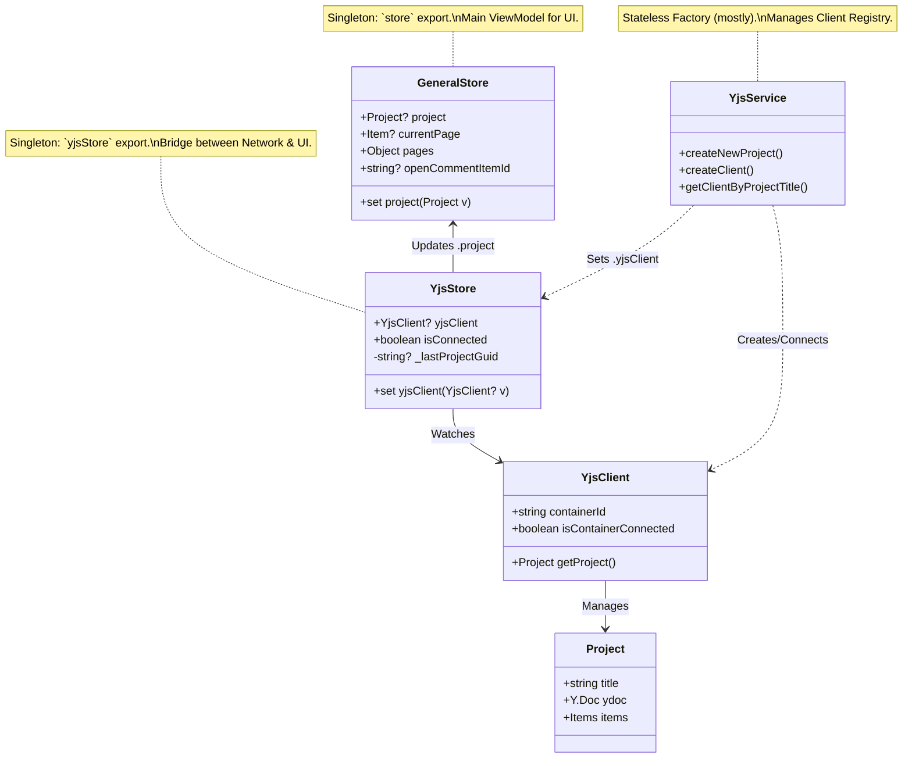
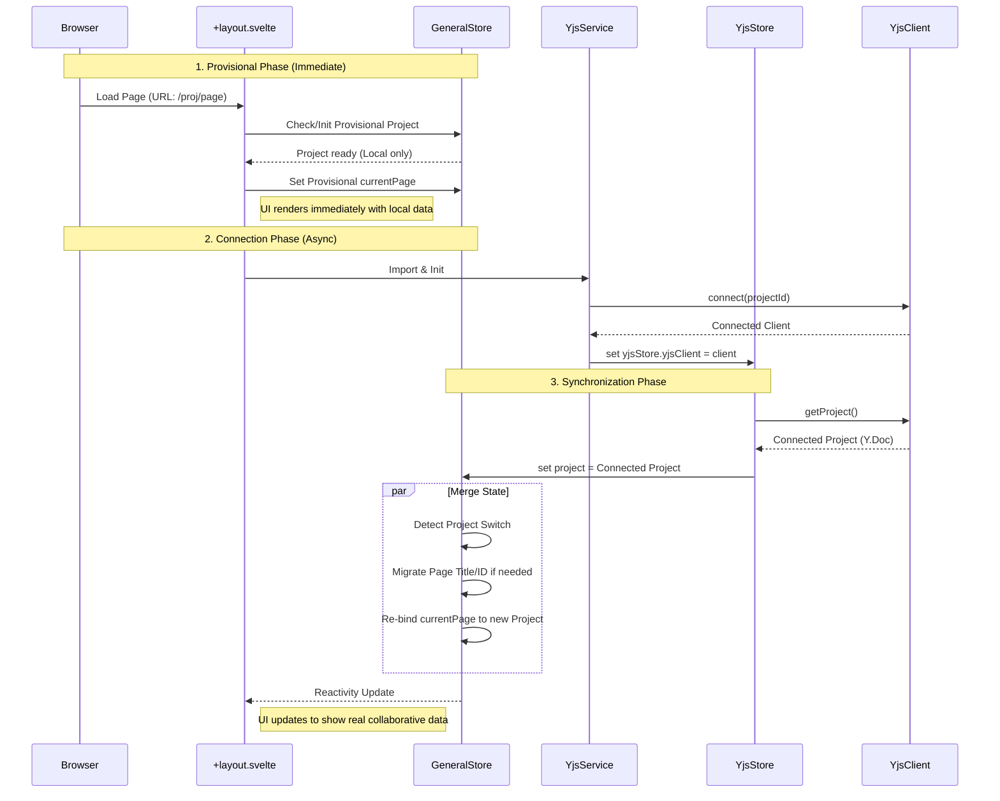
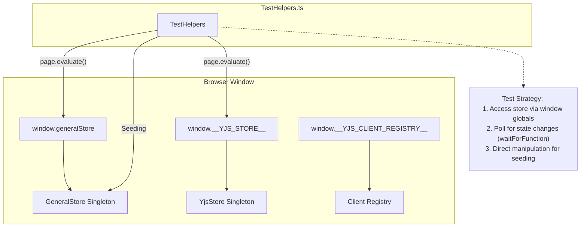

# State Management Architecture

This document describes the state management architecture of the application, focusing on `GeneralStore`, `YjsStore`, and the initialization process.

## Component Overview

The application uses a hybrid state management approach:

1. **Svelte 5 Runes**: `GeneralStore` (`store.svelte.ts`) uses `$state` and `$derived` for reactive UI state.
2. **Yjs**: Distributed state for collaborative features (Project, Page, Items).
3. **YjsStore**: A bridge that monitors `YjsClient` connection status and synchronizes the collaborative `Project` model into the reactive `GeneralStore`.

## Initialization Process

The initialization flow ensures that the UI has _something_ to show immediately (Provisional Project), and then seamlessly switches to the collaborative data when the connection is established.

## Test Dependency Injection

In E2E tests (Playwright), we need to inspect and manipulate the internal state. Since Svelte stores are singletons, we expose them to `window` for test access.

## Key Files

- `client/src/stores/store.svelte.ts`: **GeneralStore**. Core application state.
- `client/src/stores/yjsStore.svelte.ts`: **YjsStore**. Reactivity bridge.
- `client/src/lib/yjsService.svelte.ts`: **YjsService**. High-level connection logic.
- `client/src/routes/+layout.svelte`: **Bootstrapper**. Orchestrates the init flow.
